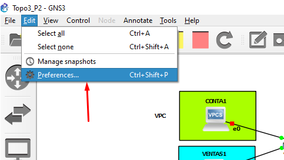
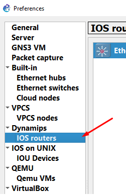
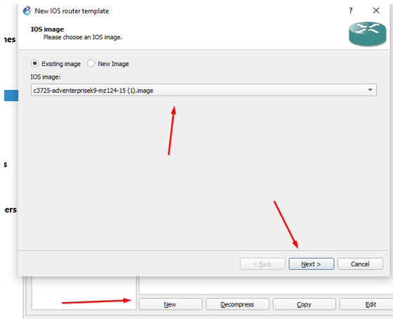
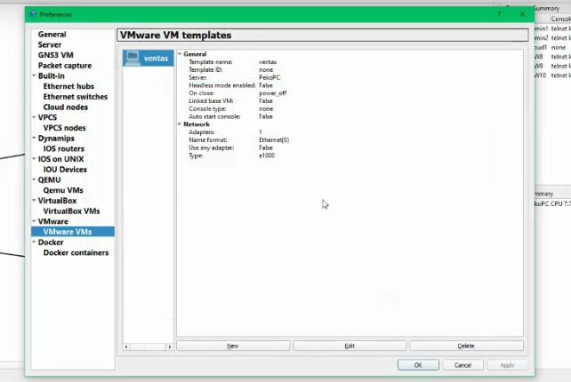
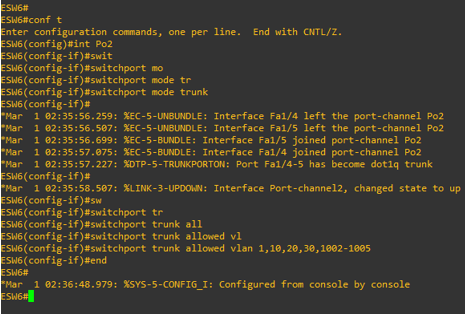
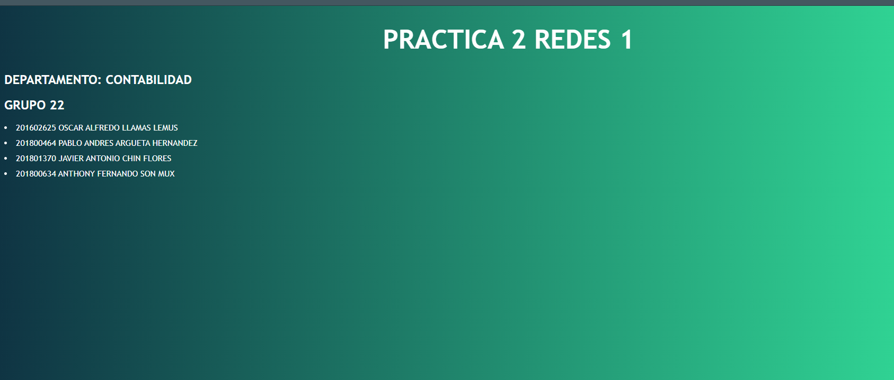

# Topologia 1

como primer paso podremos todos los dispostivos necesario para la creacion de la tolpologia 1

para ello es de suma importancia , tener el router

    

        Figura 1. Importe de imagen Router.
    

    

 

nos dirigimos hacia IO Routers 

    

        Figura 2. Importe de imagen Router.
    

    

 

hacemos click en el aparado que dice  New y seleccionamos la imágen del Router y le damos siguiente hasta llegar a la opcion de finalizar

    

        Figura 3. Importe de imagen Router.
    

    

 

Asi mismo para las maquinas de VMware , debemos dirigirnos hacia VmwaresVMs

    

        Figura 4. buscando el apartado wmware.
    

    

 

luego seleccionamos la maquina que deseamos , previamente habiando configurado las  sub-redes y con esto ya podremos ponerla en la topologia y estaremos listos para armarla.

    

        Figura 5. nueva maquina.
    

      

 

una vez ya se tiene armada procedemos a colocar las ips para las vps con el comando
ip "ip" "mascara" "gateway"

    

        Figura 6. topologia armada.
    

      

 

para corroborar que  este bien podemos correr el comando show ip , y luego darle save para la persistencia de esa configuracion.

    

        Figura 7. mostrando la ip.
    

      

 

En las maquinas virtuales se cambian en este apartado , en este caso la distro usada fue antix de sistema operativo GNU/linux.

    

        Figura 7. mostrando la ip.
    

      

 

de una vez en en esta parte desde VMware se puede configurar las subredes tal como se muestra en esta imagen

    

        Figura 8. configuracions de subredes.
    

      

 

Una vez configurada la IP de los dispositivos finales procedemos a configurar los routers con los siguientes comandos:

### ESW8
-- Po1
>conf t

>int range f1/1 -2

>channel-group 1 mode on

>exit

-- Po3
>conf t
>int range f1/5 -6
>channel-group 3 mode on
>exit

### ESW10
-- Po3
>conf t

>int range f1/5 -6

>channel-group 3 mode on

>exit

-- Po2
>conf t

>int range f1/3 -4

>channel-group 2 mode on

>exit

### ESW9
-- Po1

>conf t

>int range f1/1 -2

>channel-group 1 mode on

>exit

-- Po2
>conf t

>int range f1/3 -4

>channel-group 2 mode on

>exit

    

        Figura 9 configuracion de Port channels.
    

      

 

# siguiente Paso:

Tenemos que configurar los enlaces troncales y de acceso
 - troncales entre los routers
 - de acceso hacia los dispositivos finales

### TRONCAL
    conf t
    int f#/#      o bien     int Po#
    switchport mode trunk
    switchport trunk allowed vlan 1,#,#,#,...,#,1002-1005
    end

### ACCESO
    conf t
    int f#/#
    switchport mode access
    switchport access vlan #
    end

    

        Figura 10 Modos troncales.
    

      

 

### ahora la configuracion de la Nube

en este paso seleccionamos un puerto que este desocupado  y ponemos la ip del host que proveera el servicio para la comunicacion.

    

        Figura 10 configuracion de nube.
    

      

 

# PAGINAS WEB

## pagina de contabiliadad
para la pagina de contabilidad se utilizo apache la cual levanta un html puro y lo expone en el puerto 80

    

        Figura 11 contabiliadad.
    

      

 

# pagina de ventas
la pagina de ventas esta levantada por medio de node js y una motor de planitllas llamado EJS , La base de datos usada es mongodb la cual fue implementada con docker pero se encuentra en la maquina virtual de informatica expuesta en el puerto 27017 el por default de mongo.

    

        Figura 12 Ventas.
    

      

 
