# TOPOLOGIA 3

Si en dado caso no tenemos la imágen del Router procedemos a importarla, para ello vamos al apartado de Edit y al apartado de Preferences.

    

        Figura 1. Importe de imagen Router.
    

    

 

- Nos vamos al apartado de IOS Routers

    

        Figura 2. Importe de imagen Router.
    

    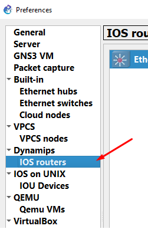

 

- Le damos en el aparado New y seleccionamos la imágen del Router, le damos en Next, nos dirá si queremos que sea EthernetSwitch o no, podemos modificar las interfaces y al final en un área de texto de color verde si aparece vacia le daremos en buscar, luego de terminar el proceso le damos en finalizar.

    

        Figura 3. Importe de imagen Router.
    

    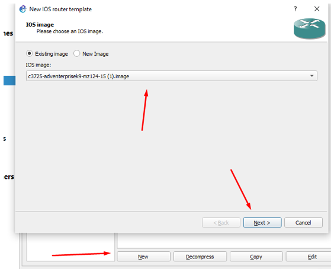

 

- Procedemos a crear la topología 3 con las conexiones como se crea más convenientes.

    

        Figura 4. Esquema inicial de la topología.
    

    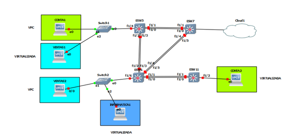

 

- Se hizo uso de switches, Ethernetswitches, cloud, VPCS y Máquinas Virtuales. Procedemos a configurar cada uno de los EthernetSwitch. El primer paso indica la configuración de los port-channel bajo el siguiente esquema.

    - Po1: ESW5 - ESW6 (2 enlaces)
    - Po2: ESW6 - ESW7 (2 enlaces)
    - Po3: ESW5 - ESW7 (2 enlaces)
    - Po4: ESW6 - ESW11 (2 enlaces)

## Configurando los Port-Channel
#

- Los comandos utilizados para configurar los port-channel son

    

        Figura 5. Comando para Port-Channel.
    

    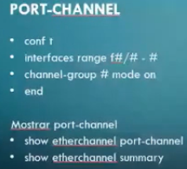

 

- Comenzamos con el <b>ESW5</b> agregando todos los port-channel

    

        Figura 6. Configurando port-channel en ESW5.
    

    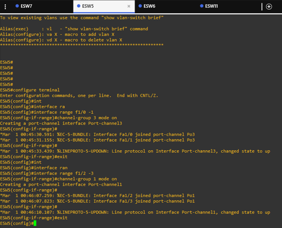

 

- Seguimos con el <b>ESW6</b> agregando los respectivos port-channels.

    

        Figura 7. Configurando port-channel en ESW6.
    

    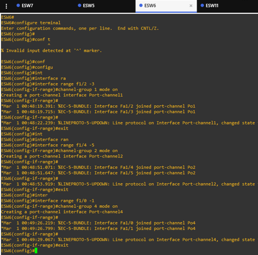

 

- Configuramos de la misma manera el <b>ESW7</b>

    

        Figura 8. Configurando port-channel en ESW7.
    

    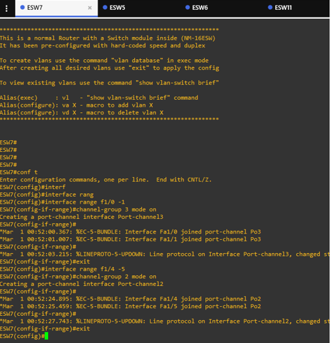

 

- Finalizamos con el <b>ESW11</b>

    

        Figura 9. Configurando port-channel en ESW11.
    

    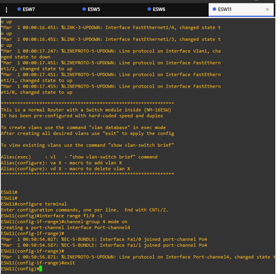

 

- Luego de configurar el port-channel para todos los EthernetSwitches y switches procedemos a realizar los enlaces troncales y de acceso.

## Configurando enlaces troncales y de acceso
#
- En el caso del switch 3 aplicamos las configuraciones necesarias.

    

        Figura 10. Configurando enlaces en Switch 3.
    

    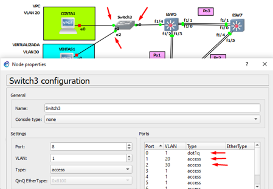

 

- Ahora con el switch 4 hacemos lo mismo con las configuraciones indicadas.

    

        Figura 11. Configurando enlaces en Switch 4.
    

    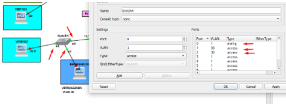

 

- Para configurar los enlaces troncales y de acceo es con el comando, si hacemos referencia a un port-channel ponemos int Po# donde # es el número de port-channel, si hacemos referencia a una intefaz normal es con int f#/#, las vlans que colocaremos acá son las mismas que vienen de la topología 2.

    

        Figura 12. Comandos para configurar modos de enlace.
    

    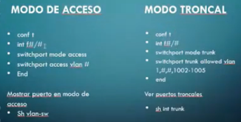

 

- Empezamos con el <b>ESW5</b>

    

        Figura 13. Configurando modos de enlace en ESW5.
    

    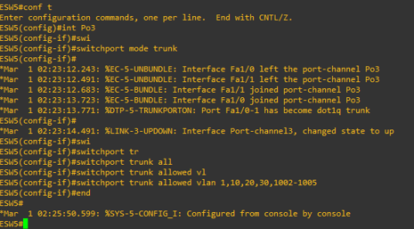
    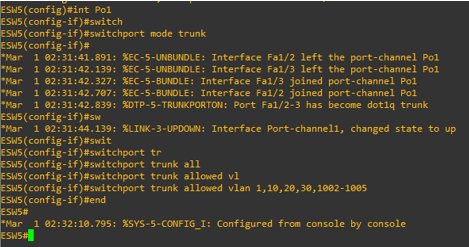
    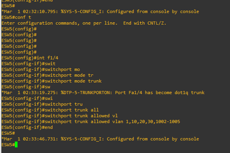

 

- Seguimos con el <b>ESW6</b>

    

        Figura 14. Configurando modos de enlace en ESW6.
    

    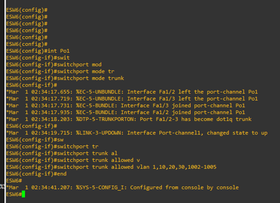
    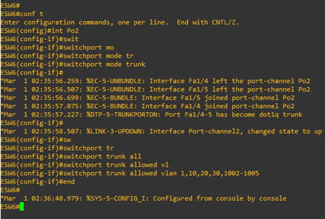
    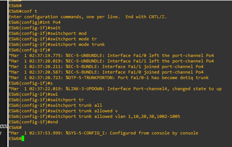
    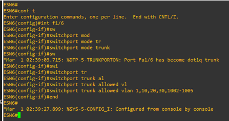

 

- Seguimos con el <b>ESW7</b>

    

        Figura 15. Configurando modos de enlace en ESW7.
    

    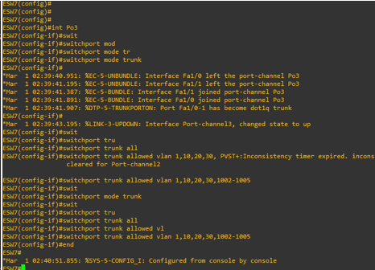
    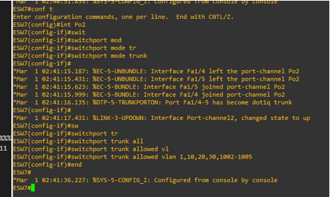
    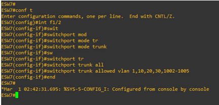

 

- Finalizamos con el <b>ESW11</b>

    

        Figura 16. Configurando modos de enlace en ESW11.
    

    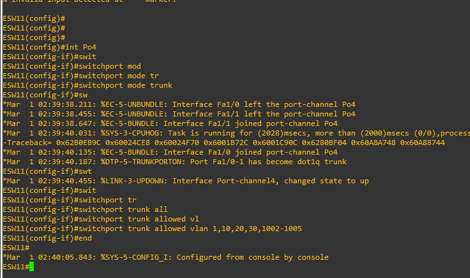

 

## Configurando VTP
#
- Procedemos a crear el VTP en modo cliente, para estos EthernetSwitches, el comando a utilizar es el siguiente.

    

        Figura 17. Comandos para configurar VTP.
    

    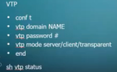

 

- El proceso para realizar el VTP es muy similar y debe realizarse en cada uno de los <b>ESW</b>.

    

        Figura 18. Configurando VTP de los ESW.
    

    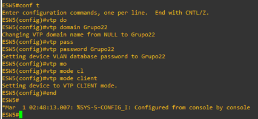
    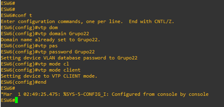
    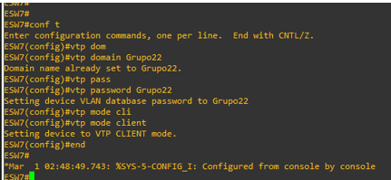
    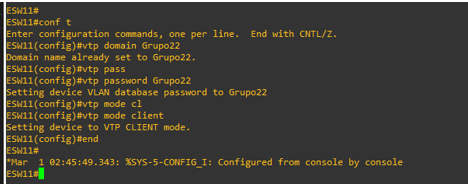

 

